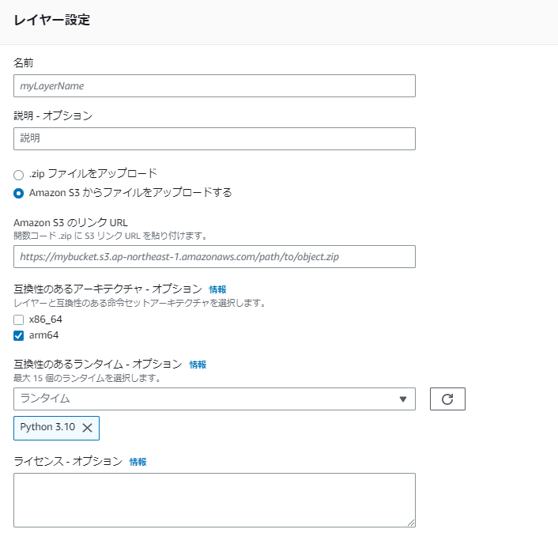

# aws-lambda-layer-py310

aws lambda layer arm Python3.10 用 のレイヤー

## Thumbnail

## Lambda layer

- アーキテクチャ：`arm64`
- ランタイム：`Python 3.10`
- `zip`のファイルサイズが`10MB`を超えているので`S3`にアップロードしてレイヤーに追加するのが推奨されます。

### pandas-cerberus

- pandas
- cerberus

### rdbms-drivers

- SQLAlchemy
- psycopg2-binary
- PyMySQL
